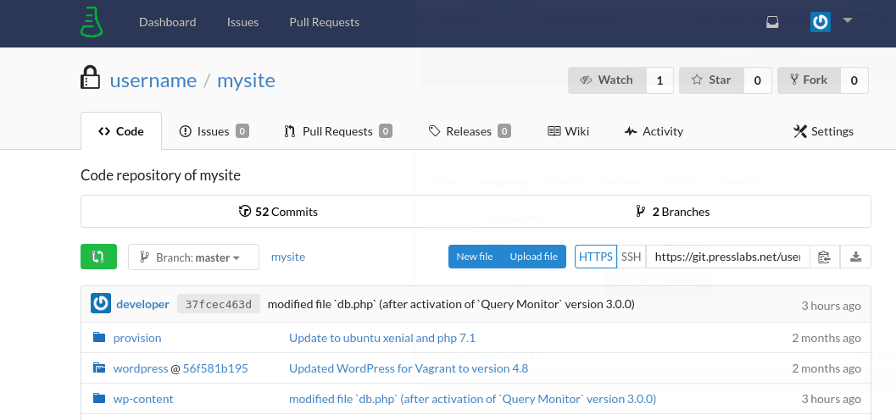
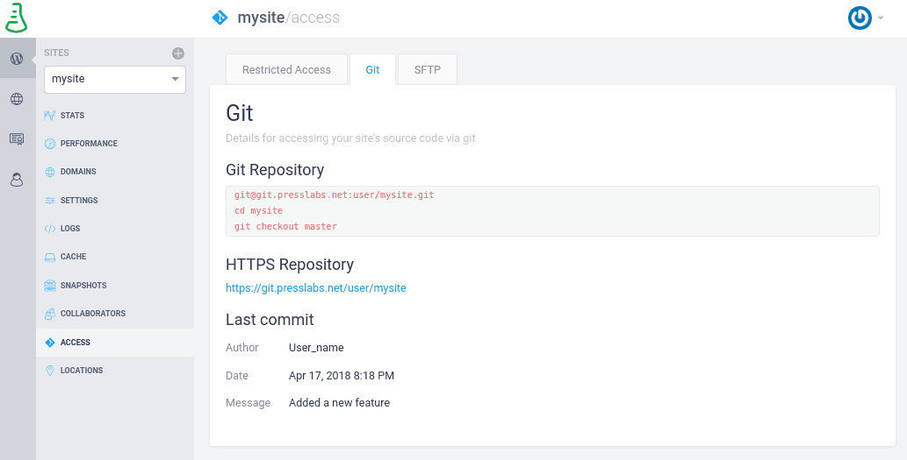
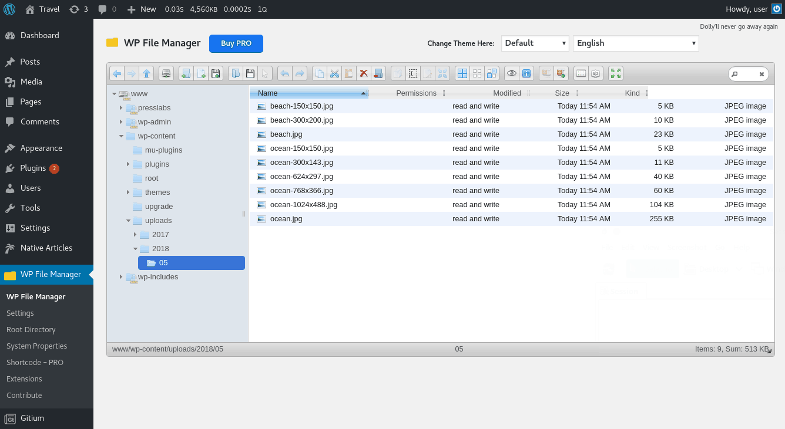
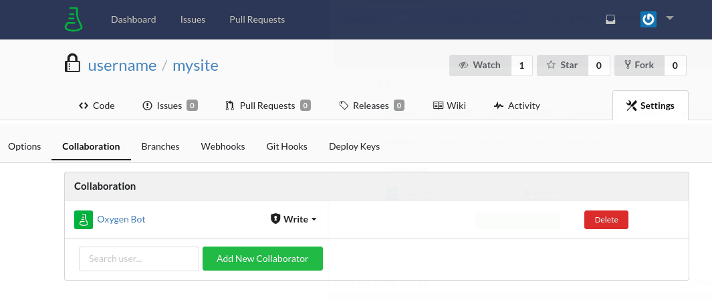

There are multiple ways to access your site's files and you'll find each of them described below.

## 1. Gitea Access

We have designed a new, simple, and straightforward web app based on [Gitea](https://gitea.io/en-US/), allowing you to easily manage your site's source code. Find out more in our [Gitea tutorial](../../getting-started/profile.md).

To sign in, simply access https://git.presslabs.net/user/login and enter your Presslabs Dashboard credentials.

This link can be seen in our Dashboard, on `Sites -> Access -> Git`.



From here you can easily get the clone URLs in order to clone your code locally:


## 2. Git Access

The recommended way for accessing your site's code (themes, plugins, and the files from the root of your site) is by using [Git](https://git-scm.com/).

To clone your code locally, you can get the Git clone URLs from our Gitea interface as shown above, or from the `Access` section of the Presslabs Dashboard:



You have two options for cloning your code:

#### via HTTPS
This is the recommended way, as you can simply clone your source code using your Presslabs Dashbord credentials:
``` none
git clone https://git.presslabs.net/<site_asdfasdfasdfsafasdfasfasfasdfowner>/<instance_name>
```

#### via SSH
To clone your code via SSH, you need to have the [SSH key configured](../development/ssh.md) on your Presslabs Dashboard. Then you can simply clone your site without having to introduce your credentials every time:
``` none
git clone git@git.presslabs.net:<site_owner>/<instance_name>.git
```

## 3. `wp-admin` Access

Our support team has, by default, secured access to your site's `wp-admin`. While the support account needs to have a password, which is randomly generated out of 64 characters, we don't use a password to connect, but a secured token that is only active for a limited amount of time. If, for any reason, you don't want to give access to our support team to your site's `wp-admin`, you can drop us an email to support@presslabs.com. Please note that without `wp-admin` access, we might not be able to offer you a proper support.

## 4. Database Access

We're not allowing direct DB access using phpMyAdmin, or other similar tools because of [security](../platform-specifications/security.md) reasons. Therefore, we recommend using the needed DB operations by following our [development guidelines](../development/presslabs-development-guidelines.md). If that's not possible, please submit a [support](../getting-started/support.md) request and we'll gladly help you out with those operations.

You can request a database snapshot from our dashboard, in the [Snapshots](../dashboard/site-management/snapshots.md) section.

## 5. Media Files Access

To access the uploads folder, we recommend using the plugin [File Manager](https://wordpress.org/plugins/wp-file-manager/), which allows you to easily manage your media files and folders.



## 6. Collaborator Access

In case you need to give access to one or more developers to your site's code, there are 2 alternatives:

* You can add their public [SSH Key](https://help.ubuntu.com/community/SSH/OpenSSH/Keys) in the [SSH Keys](../dashboard/account/ssh.md) menu from the Presslabs Dashboard. This way, they'll be granted Git access to all the sites in your dashboard.
* You can add them as collaborators to the site in question, either from the [Presslabs Dashboard](../dashboard/site-management/collaborators.md), or from the Gitea interface in the Collaboration section:



You can notice you already have a collaborator in your Gitea account, the `Oxygen Bot`, which we use to have access to your site's code.

You can only add someone with a Presslabs Dashboard account. If you want to add a developer that does not have a such an account, you can send him an invitation via email, straight from our dashboard.

## FAQs

### I have a new developer on board, how can I give them access to a single site?

You can grant him access to a single site from the [Collaborators section](../dashboard/site-management/collaborators.md#managing-collaborators-as-a-presslabs-user) of the Presslabs dashboard. Make sure you are on the right instance and simply add your new developer by introducing his username or email address, then select the developer role.

### Do you offer SFTP access?

We no longer support SFTP access, read all about it [here](https://www.presslabs.com/news/sftp-gitea/). We recommend you to use Git instead, along with our new Gitea interface.
